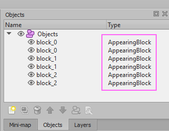

# SuperPrefabReplacement
This repo is an example of replacing Tiled objects with prefabs, automatically, during import into a Unity project. Fans of retro games may notice an inspiration from older Mega Man games. :)

Often a Tiled map will have objects in it that we want transformed into gameplay-specific objects when the map is imported into Unity.

In this example we have a series of blocks, represented as rectangle objects of type `AppearingBlock` in our map ...




What we want is to take these placeholders in our Tiled map and replace them with prefab instances in Unity. This is where **Prefab Replacements** come into play.

Prefab Replacements
-------------------
Prefab Replacements are managed in the `SuperTiled2Unity Settings`, which are found in your `Project Settings` diaglog.


What we want to do here is add an entry that replaces `AppearingBlock` objects in your Tiled map with some prefab. In the example provided, we use `AppearingBlockPrefab`.


Now every time a Tiled map in your Unity project is imported it will replace `AppearingBlock` objects with `AppearingBlockPrefab` instances.


> **Tip**: Changes to your Prefab Replacements list are not autoumatically applied to Tiled maps in your project. You will need to resave your Tiled map file (easiest and fastest) or use the `Reimport Tiled Assets` button in the SuperTiled2Unity settings window.

Custom Properties Supported
---------------------------

This example includes scripting that groups our appearing blocks and shows them in order during gameplay. The grouping order is set in Tiled using [Custom Properties](https://doc.mapeditor.org/en/stable/manual/custom-properties/). This allows us to change property values, in Tiled, that get picked up by our prefab instances.

> **Tip**: See the SuperTiled2Unity documentation for advanced [Custom Properties support](https://supertiled2unity.readthedocs.io/en/latest/manual/custom-properties.html).

In this example, the `AppearingBlock` objects in Tiled have a custom property of type `int` named `SetGroupNumber`.


When using Prefab Replacements, SuperTiled2Unity will search through all `MonoBehaviour` components on an instanced prefab and look for a matching `method`, `property`, or `field` and set it to the value given for each custom property.

In this example, our appearing block prefab has an `AppearingBlock` mono behaviour that has such a matching method, `SetGroupNumber`, that is invoked.

```cs
using UnityEngine;

public class AppearingBlock : MonoBehaviour
{
    public int m_GroupNumber;

    // Called from SuperTiled2Unity Replace Prefabs feature
    public void SetGroupNumber(int number)
    {
        m_GroupNumber = number;
    }
}
```

Note that we could have used a property or field instead of a method ...

```cs
// Use a public int field (these are serialized by Unity)
public int SetGroupNumber;

// Use a public int property
public int SetGroupNumber { get; set;} 

// Use a public void(int) method
public void SetGroupNumber(int value);
```

> **Tip**: When using custom properties this way make sure that your methods, properties, or fields are `public` and have a matching name and type - otherwise they will not be called. Methods also must return the `void` type.

With our `Prefab Replacement`, `Custom Properties`, and `MonoBeahviours` in place we know have our example map being imported to our design.


Feel free to download the example and experiment with it further.

Thanks and good luck with your game.

Sean Barton